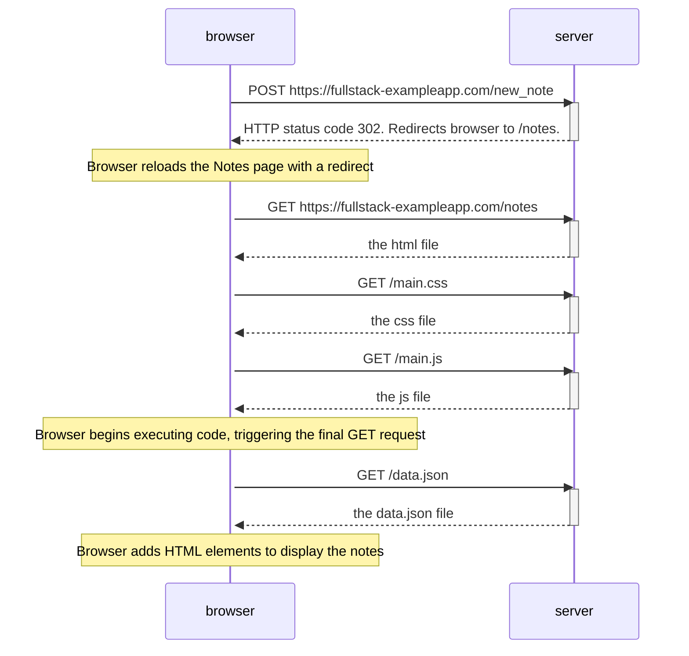

```mermaid
sequenceDiagram
    participant browser
    participant server

    browser->>server: POST https://fullstack-exampleapp.com/new_note
    activate server
    server-->>browser: HTTP status code 302. Redirects browser to /notes.
    deactivate server
    activate browser
   
    note over browser: Browser reloads the Notes page with a redirect
    
    browser->>server: GET https://fullstack-exampleapp.com/notes
    activate server
    
    server-->>browser: the html file
    deactivate server

    browser->>server: GET /main.css
    activate server
    server-->>browser: the css file
    deactivate server


    browser->>server: GET /main.js
    activate server
    server-->>browser: the js file
    deactivate server

    note over browser: Browser begins executing code, triggering the final GET request

    browser->>server: GET /data.json
    activate server
    server-->>browser: the data.json file
    deactivate server

    note over browser: Browser adds HTML elements to display the notes


    

```