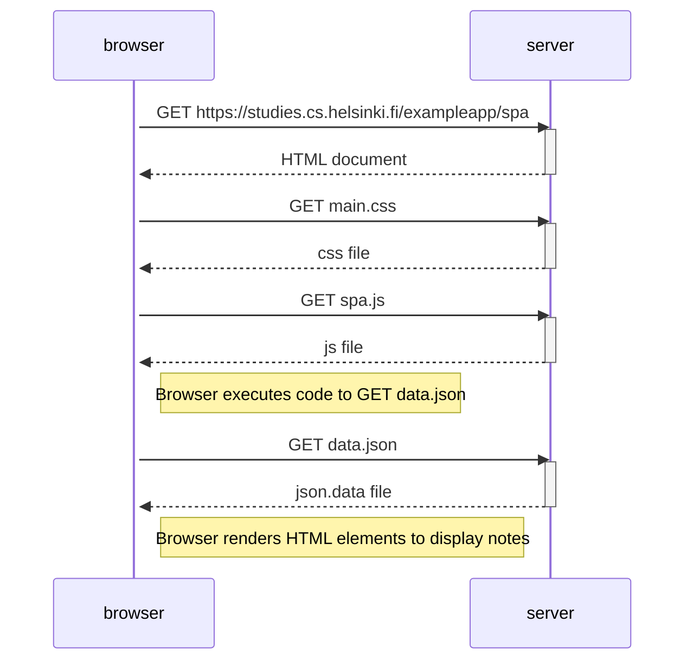

```mermaid
sequenceDiagram
    participant browser
    participant server

    activate browser
    browser->>server: GET https://studies.cs.helsinki.fi/exampleapp/spa
    activate server

    server-->>browser: HTML document
    deactivate server
    
    browser->>server: GET main.css
    activate server

    server-->>browser: css file
    deactivate server

    browser->>server: GET spa.js
    activate server

    server-->>browser: js file
    deactivate server

    note right of browser: Browser executes code to GET data.json

    browser->>server: GET data.json
    activate server

    server-->>browser: json.data file
    deactivate server

    note right of browser: Browser renders HTML elements to display notes
```